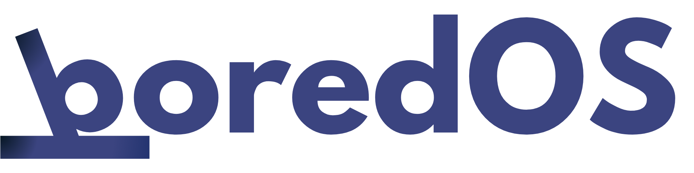
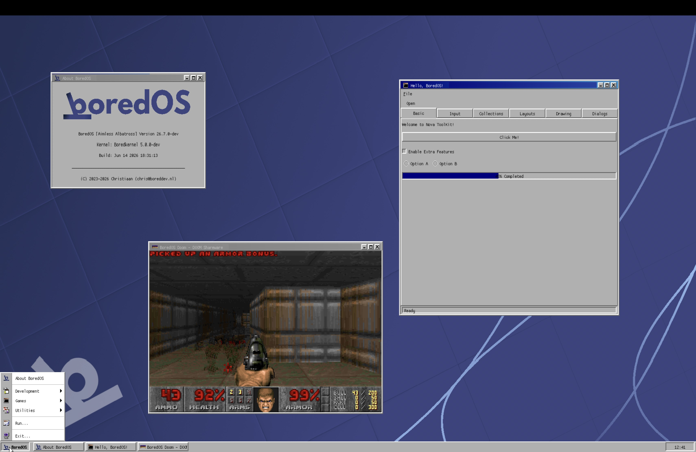

  

  <h3>A modern x86_64 hobbyist operating system built from the ground up.</h3>

  
  
  
  

   

  [Docs](docs/README.md) · [Build & Run](docs/build/usage.md) · [AppDev SDK](docs/appdev/sdk_reference.md) · [Discord](https://discord.gg/J2BxWaFAgY) · [Support](https://buymeacoffee.com/boreddevhq)

---

> [!NOTE]
> The screenshot above may represent a previous build and is subject to change as the UI evolves.

---

## Features

### Kernel and Architecture
- **Long Mode (x86_64)** 
- **SMP** — Multi-core with IPI-based scheduling and cross-core synchronization
- **Memory Management** — Slab allocator with object pooling; handles physical/virtual mapping
- **VFS** — Unified interface over FAT32, TAR, ProcFS, and SysFS
- **Preemptive Scheduling** — Priority-based, with full context isolation per process
- **Hardware Support** — PCI, AHCI, PS/2, ACPI drivers
- **Virtual Terminals** — 10 independent TTYs (`/dev/tty1`–`/dev/tty10`), each with its own graphics buffer

### Display & Compositing
- **Nova Compositor** — Userland window server over a UNIX socket (`/tmp/nova.sock`)
- **Framebuffer** — `/dev/fb0` for direct pixel access and mode switching
- **Window Management** — Layered rendering, decorations, focus, and client event routing
- **Input Routing** — Keyboard and mouse via `/dev/keyboard` and `/dev/mouse`

### Networking
- **TCP/IP** — lwIP stack with DHCP, DNS, and Berkeley sockets
- **Utilities** — `ping`, `curl`, `telnet`

### Applications
| Category | Applications |
|----------|--------------|
| Shell & CLI | bsh, kilo, ls, grep, find, tar |
| Development | TCC, Lua, POSIX syscalls, custom app framework |
| System | ps, fdisk, mkfs_fat, df, du, lsblk, pci_list, meminfo, sysfetch |
| Graphics | Nova compositor + example clients (taskbar, wallpaper daemon) |
| Network | ping, curl, telnet |

---

## 📚 Documentation

| Guide | Description |
|-------|-------------|
| [Documentation Index](docs/README.md) | Start here! |
| [Architecture Overview](docs/architecture/README.md) | Deep dive into the kernel |
| [Building and Running](docs/build/usage.md) | Set up your build environment |
| [AppDev SDK](docs/appdev/custom_apps.md) | Build your own apps for BoredOS |

---

## ☕ Support

BoredOS is a community hobby project. If you find it interesting, a coffee goes a long way!

---

## History

**BoredOS** is the successor to **[BrewKernel](https://github.com/boreddevnl/brewkernel)**, a project started in 2023. BrewKernel served as the foundational learning ground but has since been officially deprecated and archived — it no longer receives updates, bug fixes, or pull request reviews.

BoredOS is a complete architectural reboot, applying years of lessons learned to build a cleaner, more modular, and more capable system.

> [!IMPORTANT]
> Please direct all issues, discussions, and contributions to this repository. Legacy BrewKernel code is preserved for historical purposes only and is not compatible with BoredOS.

---

## License

**Copyright (C) 2023–2026 Christiaan (chris@boreddev.nl)**

Distributed under the **GNU General Public License v3**. See [`LICENSE`](LICENSE) for details.

> [!IMPORTANT]
> You must retain all copyright headers and include the original attribution in any redistributions or derivative works. See the [`NOTICE`](NOTICE) file for more details.
