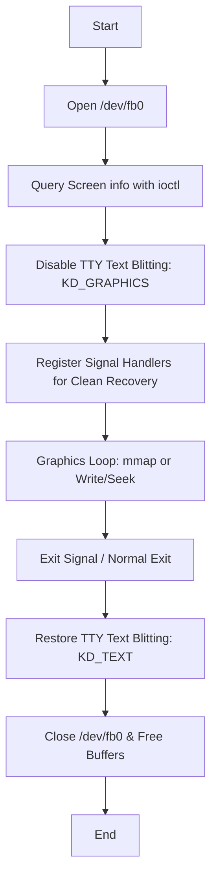

# Direct Framebuffer Graphics Guide

BoredOS provides a Linux-compatible raw framebuffer interface at `/dev/fb0`. This guide explains how to write high-performance graphical userspace applications (like custom GUI libraries, games, or display servers) that render directly to the screen.

---

## 1. Concepts and Lifecycle

Direct framebuffer drawing bypasses standard desktop compositing. Your application interacts directly with physical video memory. Writing a robust framebuffer application requires managing a strict lifecycle:



> [!CAUTION]
> **TTY Blit Restoration is Critical!**
> If your application crashes or exits without setting the TTY back to `KD_TEXT` mode, the user's terminal will remain black and appear frozen, requiring a system reboot. You **must** intercept termination signals (`SIGINT`, `SIGTERM`) to restore the text console cleanly.

---

## 2. Querying Screen Specifications

Before rendering, you must query the display's active resolution, color depth, and alignment details. Open `/dev/fb0` and invoke standard `ioctl` calls:

```c
#include <fcntl.h>
#include <sys/ioctl.h>
#include <sys/kd.h>
#include <unistd.h>
#include <stdint.h>

int fb_fd = open("/dev/fb0", O_RDWR);
struct fb_var_screeninfo vinfo;
struct fb_fix_screeninfo finfo;

ioctl(fb_fd, FBIOGET_VSCREENINFO, &vinfo);
ioctl(fb_fd, FBIOGET_FSCREENINFO, &finfo);
```

### Key Parameters to Respect:
- **`vinfo.xres` / `vinfo.yres`**: The visible screen resolution (e.g. `1024x768`).
- **`vinfo.bits_per_pixel`**: The color depth (always `32` on BoredOS, mapping to 4 bytes per pixel).
- **`finfo.line_length`**: The width of a single row in **bytes**, which may include hardware alignment padding. **Never assume `line_length == xres * 4`!** Always use `finfo.line_length` for row navigation.

---

## 3. Disabling Console Overwrites

The kernel runs an active background console blitter that periodically flushes standard shell text output to the screen. To prevent the shell from clobbering your graphics:

1. Open standard input (`fd 0`) or `/dev/tty`.
2. Toggle the console to Graphics Mode:
   ```c
   ioctl(0, KDSETMODE, (void*)KD_GRAPHICS);
   ```
3. To restore standard text input/output on exit, toggle back:
   ```c
   ioctl(0, KDSETMODE, (void*)KD_TEXT);
   ```

---

## 4. High-Performance Rendering Techniques

BoredOS supports two primary rendering methods for `/dev/fb0`:

### Method A: Zero-Copy Memory Mapping (`mmap`)
Memory mapping is the fastest rendering method. By mapping physical screen memory into your process's address space, you can manipulate pixels with pure CPU memory operations without the overhead of system calls.

#### Stride (Line Length) Offset Math
A 32-bpp display uses 4 bytes per pixel. To compute the index of a pixel at `(x, y)` in a mapped 32-bit array, you must divide `finfo.line_length` by `4` to convert the stride from bytes to `uint32_t` offsets:

$$\text{index} = y \times \left( \frac{\text{line\_length}}{4} \right) + x$$

#### `mmap` Example:
```c
uint32_t screen_size = finfo.line_length * vinfo.yres;
uint32_t *map_base = (uint32_t *)mmap(NULL, screen_size, PROT_READ | PROT_WRITE, MAP_SHARED, fb_fd, 0);

if (map_base == MAP_FAILED) {
    // Handle error
}

// Draw a green pixel at (x=100, y=50)
uint32_t stride = finfo.line_length / 4;
map_base[50 * stride + 100] = 0xFF00FF00; // BGRA Green

// Cleanup
munmap(map_base, screen_size);
```

### Method B: Double-Buffering with Seek/Write
If you prefer standard file I/O or want to maintain a separate graphics buffer on the heap, you can write full frames sequentially:

1. Allocate a heap buffer matching `screen_size`.
2. Perform all drawing computations inside the heap buffer (preventing flickering/tearing).
3. Flush the frame by seeking to `0` and writing the entire buffer:
   ```c
   lseek(fb_fd, 0, SEEK_SET);
   write(fb_fd, heap_buffer, screen_size);
   ```

---

## 5. Complete C Application Template

Below is a robust, production-ready template for a BoredOS raw graphics application. It handles screen queries, enables memory mapping, registers signal interceptors to ensure the console is safely restored, and renders a smooth animated cursor.

```c
// BOREDOS_APP_DESC: Direct graphics framework template.
#include <stdio.h>
#include <stdlib.h>
#include <string.h>
#include <fcntl.h>
#include <unistd.h>
#include <signal.h>
#include <sys/ioctl.h>
#include <sys/kd.h>
#include <sys/mman.h>
#include <stdint.h>

// Global states for signal handler cleanup
int g_fb_fd = -1;
uint32_t *g_fb_ptr = MAP_FAILED;
uint32_t g_screen_size = 0;

// Restore TTY and exit cleanly
void restore_console_and_exit(int sig) {
    if (g_fb_ptr != MAP_FAILED && g_screen_size > 0) {
        munmap(g_fb_ptr, g_screen_size);
    }
    if (g_fb_fd >= 0) {
        close(g_fb_fd);
    }
    
    // Crucial: Restore console text mode
    ioctl(0, KDSETMODE, (void*)KD_TEXT);
    
    printf("\nCleaned up graphics and restored TTY text mode (Signal %d).\n", sig);
    exit(0);
}

int main(void) {
    // 1. Open the framebuffer device
    g_fb_fd = open("/dev/fb0", O_RDWR);
    if (g_fb_fd < 0) {
        printf("Error: cannot open /dev/fb0\n");
        return 1;
    }

    // 2. Query screen configuration
    struct fb_var_screeninfo vinfo;
    struct fb_fix_screeninfo finfo;
    if (ioctl(g_fb_fd, FBIOGET_VSCREENINFO, &vinfo) < 0 ||
        ioctl(g_fb_fd, FBIOGET_FSCREENINFO, &finfo) < 0) {
        printf("Error: failed to query framebuffer layout.\n");
        close(g_fb_fd);
        return 1;
    }

    g_screen_size = finfo.line_length * vinfo.yres;
    uint32_t stride = finfo.line_length / 4;

    // 3. Register signals to catch Ctrl+C or kill events and recover TTY
    signal(SIGINT, restore_console_and_exit);
    signal(SIGTERM, restore_console_and_exit);

    // 4. Disable standard console text blitting
    ioctl(0, KDSETMODE, (void*)KD_GRAPHICS);

    // 5. Memory map the physical display
    g_fb_ptr = (uint32_t *)mmap(NULL, g_screen_size, PROT_READ | PROT_WRITE, MAP_SHARED, g_fb_fd, 0);
    if (g_fb_ptr == MAP_FAILED) {
        // Recover text console before exiting
        ioctl(0, KDSETMODE, (void*)KD_TEXT);
        printf("Error: mmap screen mapping failed!\n");
        close(g_fb_fd);
        return 1;
    }

    // 6. Graphics Loop
    int anim_frame = 0;
    while (anim_frame < 300) {
        // Clear screen to Dark Grey (BGRA layout: 0xAARRGGBB)
        for (uint32_t y = 0; y < vinfo.yres; y++) {
            for (uint32_t x = 0; x < vinfo.xres; x++) {
                g_fb_ptr[y * stride + x] = 0xFF1C1C1C;
            }
        }

        // Draw an animated bouncing ball
        int ball_x = (vinfo.xres / 2) + (int)(150.0 * (anim_frame % 50) / 25.0 - 150.0);
        int ball_y = (vinfo.yres / 2) - 100 + (anim_frame % 30) * 5;
        int radius = 40;

        for (int y = -radius; y <= radius; y++) {
            for (int x = -radius; x <= radius; x++) {
                if (x*x + y*y <= radius*radius) {
                    uint32_t draw_x = ball_x + x;
                    uint32_t draw_y = ball_y + y;
                    
                    if (draw_x < vinfo.xres && draw_y < vinfo.yres) {
                        // Blend color depending on animation progress
                        uint8_t red = anim_frame;
                        uint8_t green = 255 - anim_frame;
                        g_fb_ptr[draw_y * stride + draw_x] = 0xFF000000 | (red << 16) | (green << 8) | 0xFF;
                    }
                }
            }
        }

        // Sleep to throttle frame rate (approx 60fps)
        sleep(16);
        anim_frame++;
    }

    // 7. Clean exit
    restore_console_and_exit(0);
    return 0;
}
```

---

## 6. Integrating User Input

Direct graphics applications must manage keyboard and mouse inputs asynchronously alongside rendering. 

BoredOS routes inputs to two VFS sources:
1. **`/dev/keyboard`** / **Standard Input (`fd 0`)**: Reads key events. The input stream can be set to non-blocking using `fcntl` or multiplexed with `poll()` / `select()` to verify data availability without blocking execution:
   ```c
   struct pollfd fds[1];
   fds[0].fd = 0; // stdin
   fds[0].events = POLLIN;
   
   if (poll(fds, 1, 0) > 0) { // Check instantly with 0ms timeout
       char key;
       read(0, &key, 1);
       // Process keyboard input
   }
   ```
2. **`/dev/mouse`**: Provides raw packet events detailing relative movement $x, y$ coordinates and button click states.

---
