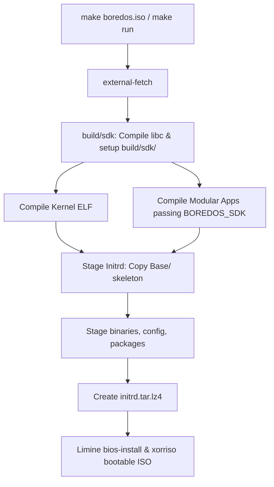

# Building, Running, and Deployment

BoredOS utilizes a highly modular architecture. Core userland binaries, shells, environments, and assets are isolated into specialized external repositories stored under `external/` and dynamically staged during compilation.

---

## External Dependencies

External repositories are managed as Git submodules under `external/`. Each submodule is pinned to a specific commit in `.gitmodules`.

### Cloning with dependencies:
```sh
git clone --recurse-submodules https://github.com/BoredOS/BoredOS.git
```

### If you already cloned without submodules:
```sh
git submodule update --init --recursive
```

### Updating submodules to latest:
```sh
git submodule update --remote
```

When compile commands like `make boredos.iso` or `make run` are executed, the Makefile triggers the `external-fetch` target which runs `git submodule update --init --recursive` to ensure all dependencies are present.

---

## The Staged Build & Staging Pipeline

The build process enforces a multi-phase build pipeline:



### The Compile Phases:
1. **SDK Bootstrap Phase**:
   - `external/libc` is compiled first. It installs standard headers and startup routines (`crt0.o`, `crt1.o`, `libc.a`) directly into a local target SDK folder: `build/sdk/`.
2. **Integrated Multi-Repo Compilation**:
   - The root Makefile builds all other external application repositories in parallel, explicitly passing `BOREDOS_SDK=$(abspath build/sdk)` to their sub-Makefiles.
   - The application sub-Makefiles detect this local SDK path, link immediately against it, and skip all local fetching or SDK rebuild routines, providing massive speedups.
3. **Initrd Assembly & Staging**:
   - The `Base/` folder contains the root skeleton of the BoredOS file system (including standard directories like `/Library`, `/boot`, `/etc`, `/usr`, `/dev`, etc.).
   - The build script first copies the `Base/` contents to `build/initrd/` as the starting skeleton.
   - Compiled binaries, assets, documentation, and modular `.bup` package files are then copied and staged into their respective paths within `build/initrd/` before compression.
4. **Single-Pass Dispatch Target**:
   - Targets like `make run` and `make run-hd` resolve platform-specific emulation rules at parse-time using GNU Make conditionals (`ifeq ($(HOST_OS),Darwin) run: run-mac ...`), completely preventing duplicate sub-make execution.

---

## 4. Standalone Repository Builds (Developer Friendly)

Every external repository features complete isolation and autonomy. A developer can copy or clone **any** of the directories inside `external/` and compile it independently outside the BoredOS environment:

- **Isolated Build Flow**:
  - If a sub-Makefile detects that `BOREDOS_SDK` is not defined, it knows it is being run standalone.
  - It automatically clones `https://github.com/boredos/libc.git` locally.
  - It builds it locally, caches the compiled artifacts at `build/sdk/`, and compiles the standalone application binary perfectly.

---

## 5. Minimum System Requirements

To run BoredOS successfully (either in emulation or on bare metal), your target machine should meet the following minimum requirements:

- **CPU**: An `x86_64` (64-bit) compatible processor.
- **Memory**: Approximately `~256 MB` of RAM.
- **Display**: A display, rendered via the framebuffer. (A GPU will not work.)
- **Networking (Optional)**: A compatible Network Interface Card (NIC) is required if you want to use the networking stack. (e.g. Intel E1000, Realtek 8139, or VirtIO NIC.)

---

## 6. Running and Deployment

### Emulation:
To test the built ISO image quickly in QEMU:
```sh
make run
```
To boot directly from an UEFI-enabled expandable hard disk image (after installing with boredos_install inside of BoredOS)
```sh
make run-hd
```

### Bare Metal Flashing:
1. Compile the project to generate `boredos.iso`.
2. Flash the ISO to a USB drive using a raw imaging tool (such as `dd` or **Balena Etcher**).
3. Disable **Secure Boot** in your target PC's UEFI firmware.
4. Select the USB drive from the bootloader menu. BoredOS boots natively on both legacy **BIOS** and modern **UEFI** systems.
